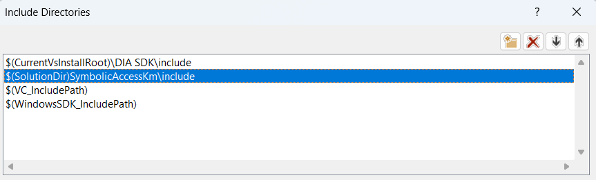

# Overview

Symbolic Access is library written in c++17 that allows you to download and parse Microsoft PDB (Program Database) files for modules. It can be done, at runtime, in both user/kernel mode to access all functions and global variables
by extracting offsets from PDB file and accessing any memory as a struct (which was in pdb).


# Compilation

##### SymbolicAccessUM

You need only Visual Studio 2019/2022

##### SymbolicAcccessKM / SybmolicAccessExampleKM

You need Visual Studio 2019/2022 with WDK

##### SymbolicAccessTest

You need Visual Studio 2019/2022 with DIA SDK and vcpkg with installed gtest

# How to use

All you need to do is to add SymbolicAccessUM/KM to your project references

 and `SymbolicAccessKm\include` to your include directories.

Also, you have to add `$(VC_IncludePath)` to your include directories if you are using Symbolic Access in driver project


Then, in code, all you have to do is:

```c++
#include <SymbolicAccess/ModuleExtender/ModuleExtenderFactory.h>
	
symbolic_access::ModuleExtenderFactory extenderFactory{};
const auto& moduleExtender = extenderFactory.Create(L"ntoskrnl.exe");
```

This is a snippet taken from `SymbolicAccessExampleKM`, that you can use as an example on how to use a library.

# Example

`SymbolicAccessExampleKM` is an example project which uses symbolic access to find and hide explorer.exe from active process list by using simple DKOM.

# Remarks

- Firstly, symbolic access checks if pdb file is on a disk by looking at `%homedrive%/symbols`. If there is no such file, then it tries to download it to previously mentioned directory.
- Symbolic access doesn't support demangling, so if you want to access c++ function or global variable you need to pass it's mangled name.
- Symbolic access works with bitfields i.e. you can set/get structure member which is a bitfield. In case of setting the value bigger than what bitfield can hold, it will do nothing.
- In case there are more symbols with same name, symbolic access will work the same way as IDA works - by appending to  each successive function/global variable `_0`, `_1` etc.
- In case there are more structs with the same name, symbolic access will take the one with the highest number of members.

# Supported OS

Symbolic access should work on OS no older than windows 7, up to the latest version and on every architecture i.e x86, x86_64, arm64 (not tested), in both user and kernel mode.

# License

[phnt](https://github.com/winsiderss/phnt) - CC-BY-4.0 license

[jxy](https://github.com/jxy-s/stlkrn) - MIT license

Symbolic access - MIT license

# Credits

[pdb](https://github.com/willglynn/pdb) - Most properly written non Dia/DbgHelp based pdb parser.

